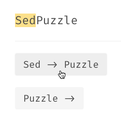

# s/Math + AI/ Reasoning in LLMs



# Documentation
## ``schema.py``
We define the data scheme using [Pydantic](https://docs.pydantic.dev/latest/) in ``schema.py``. This prevents any data validation problems. For the most part, you can treat it as a regular Python class that you can read from/write into JSON strings. We perform some basic validation checks to prevent invalid data being processed.
## ``utils.py``
- ``read_problem_folder()``/``read_solution_folder()``: Reads the corresponding JSON files and loads them as Python objects using Pydantic.
- ``write_problem_folder()``/``write_solution_folder()``:
Writes the problems/solutions to JSON files and saves them in the provided path.
- ``validate_solutions()``:
Takes in the problems and the provided solutions, and validates if the provided solution is correct for the given problem.

## ``baseline.py``
We implement a simple baseline that searches through the solution space until the empty string is reached. This is provided so that performance of LLM can be compared with traditional methods. You are free to improve it.

## Compilation and Execution for test case generator
To compile and run the `generate.cpp` file, use the following command:
```sh
g++ -std=c++17 -I /opt/homebrew/include generate.cpp -o generate
```
After compilation, you can execute the program by running:
```sh
./generate
```

## Directory Structure for using gemini API 
The script expects the following folder structure:

```
/Puzzles      # Folder containing input puzzle JSON files  
/Solutions    # Folder where output solution JSON files will be saved  
prompting_using_gemini.py  # The main script  
```

## How to Run
To execute the script, run the following command:

```sh
python3 prompting_using_gemini.py
```

The script will:

1. Read all puzzle JSON files from the `/Puzzles` directory.
2. Generate a structured prompt for each puzzle .
3. Send the generated prompt to the Gemini API for solution generation.
4. Parse the API response into a structured JSON format.
5. Save the solution in the `/Solutions` directory with filenames corresponding to the puzzle ID.

## Output Format
Each solution file follows this JSON structure:

```json
{
    "problem_id": "001",
    "solution": [0, 0]
}
```

## Notes
- The script introduces a **delay of 1 second** between API requests to prevent hitting rate limits.
- If any response cannot be parsed properly, an empty solution array will be stored.

## Problem Levels and Classification
The problems are categorized into different difficulty levels based on the following scheme:

- **Level 0**: Problem IDs 1-13, 88-93
- **Level 1**: Problem IDs 14-33
- **Level 2**: Problem IDs 34-45, 94-100
- **Level 3**: Problem IDs 46-64
- **Level 4**: Problem IDs 65-80
- **Level IMPOSSIBLE**: Problem IDs 81-87

## Reports and Documentation
A comprehensive analysis and documentation of the project is available across several reports:

- **Main Report**: A general report is available here.For detailed report related to any task see the individual task reports only. [SED puzzle report.pdf](https://github.com/kushagratrivedi2005/LLMS-in-Puzzles/blob/main/SED%20puzzle%20report.pdf)

Individual task reports are also available:
- [Task1.pdf](https://github.com/kushagratrivedi2005/LLMS-in-Puzzles/blob/main/Task1.pdf)
- [Task2.pdf](https://github.com/kushagratrivedi2005/LLMS-in-Puzzles/blob/main/Task2.pdf)
- [Task3.pdf](https://github.com/kushagratrivedi2005/LLMS-in-Puzzles/blob/main/Task3.pdf)
- [Task4.pdf](https://github.com/kushagratrivedi2005/LLMS-in-Puzzles/blob/main/Task4.pdf)

Each task report contains specific observations and findings related to its respective component.

## Directory Structure
- sample-data/
  - puzzles/                # Contains all the problem statements.
  - solutions/              # Contains the corresponding solutions for the problems.
- testing/
  - helpful_debugging/      # A debugging script that was useful during development.
  - test_case_generate_wrong/ # Identifies cases where the validator was malfunctioning by applying transitions that were not possible on a given string.
- Task1.pdf                 # Task 1 document.
- Task2.pdf                 # Task 2 document.
- Task3.pdf                 # Task 3 document.
- Task4.pdf                 # Task 4 document.

Video URL - https://iiithydstudents-my.sharepoint.com/:v:/g/personal/kushagra_trivedi_students_iiit_ac_in/EYjhyhPWB4RNh48yotmQgMQB-S9xuSMg3ifeE9h-PmsXow?nav=eyJyZWZlcnJhbEluZm8iOnsicmVmZXJyYWxBcHAiOiJPbmVEcml2ZUZvckJ1c2luZXNzIiwicmVmZXJyYWxBcHBQbGF0Zm9ybSI6IldlYiIsInJlZmVycmFsTW9kZSI6InZpZXciLCJyZWZlcnJhbFZpZXciOiJNeUZpbGVzTGlua0NvcHkifX0&e=gSzTpJ
